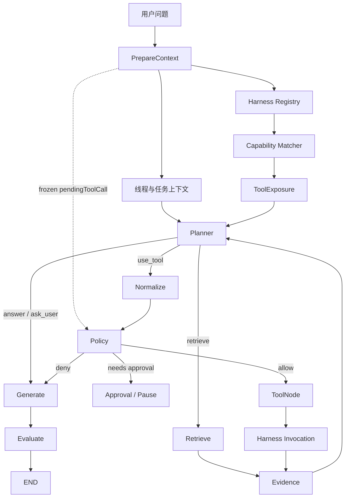

# Agent 策略

Agent 不是 UIChat Mira 中一项顺手附带的功能，而是整个产品长期投入最深的核心能力之一。

Mira 想做的并不是「给模型一堆工具，然后期待它自己发挥」，而是建立一套能够规划、执行、观察、恢复，并允许用户随时介入的任务闭环。

> 本页先固定已经形成共识的 Agent 策略。节点字段、状态结构、测试合同和实现细节会继续拆成后续专题文档。

## 用户问题如何进入 Agent

用户问题首先进入 `prepareContext`，而不是直接进入 Planner，也不是直接发起 Harness Invocation。

`prepareContext` 会读取线程与任务上下文，同时从 Harness Registry 取得能力定义，完成候选能力匹配并生成本轮 `ToolExposure`。准备完成后，普通请求才进入 Planner；只有审批恢复等已经带有冻结 `pendingToolCall` 的情况，才会绕过 Planner 直接回到 Policy。



::: html

<div style="margin:28px 0;padding:22px;border:1px solid var(--hairline,#e6dfd8);border-radius:18px;background:var(--surface-soft,#f5f0e8);overflow-x:auto;">
  <div style="font-size:12px;letter-spacing:.08em;text-transform:uppercase;color:var(--primary-active,#a9583e);margin-bottom:18px;">FULL AGENT ENTRY &amp; EXECUTION FLOW</div>

  <div style="min-width:720px;display:grid;gap:12px;">
    <div style="display:flex;justify-content:center;">
      <div style="min-width:220px;padding:14px 18px;border-radius:12px;background:#252320;color:#faf9f5;text-align:center;box-shadow:0 6px 18px rgba(37,35,32,.12);">
        <strong style="display:block;font-size:16px;">用户问题</strong>
        <span style="display:block;margin-top:4px;font-size:12px;color:#d7d2ca;">User Message / Goal</span>
      </div>
    </div>

    <div style="text-align:center;font-size:20px;line-height:1;color:var(--muted,#8a8379);">↓</div>

    <div style="padding:18px;border-radius:14px;background:var(--canvas,#faf9f5);border:2px solid var(--primary-active,#a9583e);">
      <div style="display:flex;justify-content:space-between;align-items:flex-start;gap:16px;margin-bottom:14px;">
        <div>
          <strong style="display:block;font-size:17px;">PrepareContext</strong>
          <span style="display:block;margin-top:4px;font-size:13px;color:var(--body-c,#3d3d3a);">准备线程、任务与本轮能力暴露</span>
        </div>
        <span style="padding:5px 9px;border-radius:999px;background:var(--surface-card,#efe9de);font-size:11px;white-space:nowrap;">真实 Graph 入口</span>
      </div>

      <div style="display:grid;grid-template-columns:repeat(4,minmax(140px,1fr));gap:10px;">
        <div style="padding:13px;border-radius:11px;border:1px solid var(--hairline,#e6dfd8);background:var(--surface-soft,#f5f0e8);">
          <strong style="font-size:13px;">线程与任务上下文</strong>
          <div style="margin-top:5px;font-size:12px;color:var(--body-c,#3d3d3a);">Messages · Goal · Task Frame</div>
        </div>
        <div style="padding:13px;border-radius:11px;border:1px solid var(--hairline,#e6dfd8);background:var(--surface-soft,#f5f0e8);">
          <strong style="font-size:13px;">Harness Registry</strong>
          <div style="margin-top:5px;font-size:12px;color:var(--body-c,#3d3d3a);">读取已注册能力定义</div>
        </div>
        <div style="padding:13px;border-radius:11px;border:1px solid var(--hairline,#e6dfd8);background:var(--surface-soft,#f5f0e8);">
          <strong style="font-size:13px;">Capability Matcher</strong>
          <div style="margin-top:5px;font-size:12px;color:var(--body-c,#3d3d3a);">按用户问题匹配候选能力</div>
        </div>
        <div style="padding:13px;border-radius:11px;border:1px solid var(--hairline,#e6dfd8);background:var(--surface-soft,#f5f0e8);">
          <strong style="font-size:13px;">ToolExposure</strong>
          <div style="margin-top:5px;font-size:12px;color:var(--body-c,#3d3d3a);">生成 Planner 本轮可见工具</div>
        </div>
      </div>

      <div style="margin-top:12px;padding:10px 12px;border-radius:10px;border:1px dashed var(--primary-active,#a9583e);font-size:12px;color:var(--body-c,#3d3d3a);">
        恢复入口：若 State 已带有冻结的 <code>pendingToolCall</code>，PrepareContext 后直接进入 Policy，避免 Planner 改写已冻结调用。
      </div>
    </div>

    <div style="text-align:center;font-size:20px;line-height:1;color:var(--muted,#8a8379);">↓</div>

    <div style="display:flex;justify-content:center;">
      <div style="min-width:260px;padding:15px 20px;border-radius:12px;background:var(--surface-card,#efe9de);border:1px solid var(--hairline,#e6dfd8);text-align:center;">
        <strong style="display:block;font-size:17px;">Planner</strong>
        <span style="display:block;margin-top:4px;font-size:12px;color:var(--body-c,#3d3d3a);">唯一语义决策中心</span>
      </div>
    </div>

    <div style="display:grid;grid-template-columns:1fr 1fr 1.45fr;gap:12px;align-items:stretch;">
      <div style="padding:15px;border-radius:13px;background:var(--canvas,#faf9f5);border:1px solid var(--hairline,#e6dfd8);">
        <div style="font-size:11px;letter-spacing:.06em;color:var(--primary-active,#a9583e);margin-bottom:9px;">ANSWER / ASK USER</div>
        <div style="padding:11px;border-radius:9px;background:var(--surface-soft,#f5f0e8);text-align:center;"><strong>Generate</strong></div>
        <div style="text-align:center;padding:4px 0;color:var(--muted,#8a8379);">↓</div>
        <div style="padding:11px;border-radius:9px;background:var(--surface-soft,#f5f0e8);text-align:center;"><strong>Evaluate</strong></div>
        <div style="text-align:center;padding:4px 0;color:var(--muted,#8a8379);">↓</div>
        <div style="padding:11px;border-radius:9px;background:#252320;color:#faf9f5;text-align:center;"><strong>END</strong></div>
      </div>

      <div style="padding:15px;border-radius:13px;background:var(--canvas,#faf9f5);border:1px solid var(--hairline,#e6dfd8);">
        <div style="font-size:11px;letter-spacing:.06em;color:var(--primary-active,#a9583e);margin-bottom:9px;">RETRIEVE</div>
        <div style="padding:11px;border-radius:9px;background:var(--surface-soft,#f5f0e8);text-align:center;"><strong>Retrieve</strong></div>
        <div style="text-align:center;padding:4px 0;color:var(--muted,#8a8379);">↓</div>
        <div style="padding:11px;border-radius:9px;background:var(--surface-soft,#f5f0e8);text-align:center;"><strong>Evidence</strong></div>
        <div style="text-align:center;padding:4px 0;color:var(--muted,#8a8379);">↺</div>
        <div style="padding:11px;border-radius:9px;background:var(--surface-card,#efe9de);text-align:center;"><strong>Planner</strong></div>
      </div>

      <div style="padding:15px;border-radius:13px;background:var(--canvas,#faf9f5);border:1px solid var(--hairline,#e6dfd8);">
        <div style="font-size:11px;letter-spacing:.06em;color:var(--primary-active,#a9583e);margin-bottom:9px;">USE TOOL</div>
        <div style="display:grid;grid-template-columns:1fr auto 1fr auto 1fr;gap:7px;align-items:center;">
          <div style="padding:11px 8px;border-radius:9px;background:var(--surface-soft,#f5f0e8);text-align:center;"><strong>Normalize</strong></div>
          <span style="color:var(--muted,#8a8379);">→</span>
          <div style="padding:11px 8px;border-radius:9px;background:var(--surface-soft,#f5f0e8);text-align:center;"><strong>Policy</strong></div>
          <span style="color:var(--muted,#8a8379);">→</span>
          <div style="padding:11px 8px;border-radius:9px;background:var(--surface-soft,#f5f0e8);text-align:center;"><strong>ToolNode</strong></div>
        </div>

        <div style="display:grid;grid-template-columns:1fr 1fr;gap:8px;margin-top:10px;">
          <div style="padding:10px;border-radius:9px;border:1px dashed var(--hairline,#e6dfd8);font-size:12px;text-align:center;">
            <strong>需要审批</strong><br><span style="color:var(--body-c,#3d3d3a);">Approval / Pause</span>
          </div>
          <div style="padding:10px;border-radius:9px;border:1px dashed var(--hairline,#e6dfd8);font-size:12px;text-align:center;">
            <strong>拒绝或阻断</strong><br><span style="color:var(--body-c,#3d3d3a);">Generate / Error</span>
          </div>
        </div>

        <div style="text-align:center;padding:6px 0;color:var(--muted,#8a8379);">↓ allow</div>
        <div style="padding:11px;border-radius:9px;background:#252320;color:#faf9f5;text-align:center;">
          <strong>Harness Invocation</strong>
          <div style="margin-top:4px;font-size:11px;color:#d7d2ca;">真实工具执行入口</div>
        </div>
        <div style="text-align:center;padding:5px 0;color:var(--muted,#8a8379);">↓</div>
        <div style="display:grid;grid-template-columns:1fr auto 1fr;gap:7px;align-items:center;">
          <div style="padding:11px;border-radius:9px;background:var(--surface-soft,#f5f0e8);text-align:center;"><strong>Evidence</strong></div>
          <span style="color:var(--muted,#8a8379);">↺</span>
          <div style="padding:11px;border-radius:9px;background:var(--surface-card,#efe9de);text-align:center;"><strong>Planner</strong></div>
        </div>
      </div>
    </div>

    <div style="padding:12px 14px;border-radius:11px;background:var(--surface-card,#efe9de);font-size:13px;color:var(--body-c,#3d3d3a);">
      <strong>Harness 在流程中出现两次：</strong>Planner 之前参与能力注册、匹配与 ToolExposure；Planner 决定使用工具并通过 Normalize / Policy 后，才由 Harness Invocation 执行真实调用。
    </div>

  </div>
</div>
:::

## 核心决策循环

当前稳定循环为：

```text
Planner
→ Normalize
→ Policy
→ ToolNode
→ Harness Invocation
→ Evidence
→ Planner
```

如果 Planner 选择的是检索路径，则是：

```text
Planner
→ Retrieve
→ Evidence
→ Planner
```

这两条路径的重点不是节点数量，而是职责不能互相越权。

## Planner 是唯一语义决策中心

Planner 负责判断：

- 当前用户真正想完成什么；
- 任务是否需要拆解；
- 下一步应当继续调用能力、等待用户，还是生成答案；
- 已有 evidence 是否覆盖了任务目标；
- 工具失败后是否仍有恢复路径；
- 什么时候才算真正完成。

Retrieve、ToolNode 和 Evidence 可以报告事实，但不替 Planner 宣布任务完成。

## 「证据可回答」不等于「任务已完成」

这是 Mira Agent 策略里非常重要的一条区分。

某次读取或检索命中后，当前 evidence 也许已经足以解释一个局部问题；但用户请求可能包含多个目标，或者要求继续执行真实动作。

因此必须区分：

- **evidence answerable**：当前证据能够回答什么；
- **task completable**：用户请求是否已经完整完成。

只有当关键目标都获得覆盖，Planner 才应进入最终回答。不能因为一次 `read_locate` 命中、某个摘要可读，就提前结束整个任务。

## Normalize：把模型意图变成稳定协议

模型输出并不直接进入工具执行。

Normalize 负责把不稳定的自然语言决策收敛成可验证的结构，例如：

- 明确 action 类型；
- 解析 toolId；
- 标准化参数；
- 拒绝模糊或无法执行的调用；
- 保持后续 Policy 与 ToolNode 输入稳定。

这一步的意义是：模型可以灵活思考，但执行协议不能含糊。

## Policy 与 Approval：能力存在，不等于本次允许

Policy 判断某次调用应该：

- 直接允许；
- 拒绝；
- 等待用户审批。

权限判断不能只看工具名称，还需要考虑：

- 是否会写入文件；
- 是否会启动进程；
- 是否访问外部网络；
- 是否绑定当前工作空间；
- 是否具有长期运行或明显副作用；
- 用户是否已经明确授权。

当风险需要人工判断时，Agent 应当暂停，而不是偷偷绕过去。

## Harness：控制模型本轮究竟看见什么

Mira 不希望把所有工具一次性扔给模型。

Harness 在 Agent 与具体能力之间承担治理职责：

1. 系统内部先判断哪些 capability 可能相关；
2. 再生成本轮模型真正可见的 ToolExposure；
3. 模型给出调用意图后，解析成具体 Invocation；
4. ToolNode 只执行已注册、可解析且通过 Policy 的真实工具。

这让内置工具、MCP、企业集成与未来能力可以遵守同一种运行语义，也避免「能力匹配结果」直接越过注册表变成执行入口。

## Evidence：工具结果不是一句“成功”

工具执行结束后，需要形成结构化 evidence。

Evidence 应当保留：

- 调用了什么；
- 输入参数是什么；
- 返回了哪些原始结果；
- 是否产生 artifact；
- 是否失败、超时或被阻塞；
- 当前结果能够证明什么；
- 仍有哪些目标没有覆盖。

工具返回成功，只能说明调用完成，不能自动证明用户目标已经达成。

## Recoverable 与 Terminal

Mira 把失败分成两类。

### Recoverable failure

可恢复失败表示某次工具执行没有成功，但整个任务仍可能继续。

它的基本语义是：

- Tool execution 为 failed；
- latestSummary 表示失败；
- answerReadiness 为 false；
- Planner 可以选择恢复、换路径或重试；
- 恢复机会耗尽后，Generate 可以给出受保护的说明；
- Graph 最终仍可 completed；
- Chat finishReason 为 stop。

这种失败不应被伪装成成功，但也不必让整个会话直接崩掉。

### Terminal failure

终止失败表示系统已经无法安全继续。

它的语义是：

- Graph status 为 failed；
- finishReason 为 error；
- Generate 不再运行；
- 系统明确报告终止原因。

把两类失败分开，才能同时获得可恢复性与真实错误语义。

## 人工介入不是失败，而是产品能力

Mira 的 Agent 设计允许用户在关键位置介入：

- 审批或拒绝高风险动作；
- 暂停正在推进的任务；
- 在计划偏离时纠正目标；
- 查看证据后决定是否继续；
- 当信息不足时补充输入。

真正可控的自动化，不是从头到尾不让人碰，而是系统知道什么时候应该自己推进、什么时候必须把决定交还给用户。

## 当前阶段：稳定，而不是继续堆节点

Agent V1.5 当前重点是稳定化。

这一阶段不会为了显得“更智能”而继续无边界扩张 Agent Graph。优先事项是：

- Planner 不提前收尾；
- 工具选择和能力暴露更稳定；
- Recoverable / Terminal 语义一致；
- 工具调用留下真实证据；
- 审批与副作用边界可验证；
- 黑盒测试能够覆盖主循环。

## 后续专题占位

本章之后会继续拆出这些文档：

- **Planner 策略**：任务分解、目标覆盖与完成判断；
- **Harness 能力选择**：CapabilityMatch、ToolExposure 与 Invocation；
- **Policy 与审批**：风险分类、副作用与人工介入；
- **Evidence 合同**：原始结果、摘要、artifact 与 answer readiness；
- **失败与恢复**：Recoverable、Terminal、重试与 guarded answer；
- **Agent 黑盒验证**：从公开入口检查闭环，而不是只测内部节点。

这些不是为了把架构写得更玄，而是为了让 Mira 已经投入的大量 Agent 工作能够被理解、复用和继续维护。
